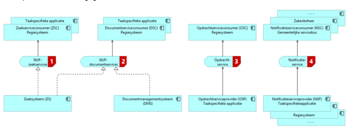

# Techniek Regie- en zaakservices

De specificatie beschrijft services voor de volgende referentiecomponenten:

* Zaaksysteem
* Zakenmagazijn
* Documentbeheersysteem
* Gemeentelijke servicebus
* Abonnementenbeheer (nieuw gedefinieerd)
* Regiesysteem
* Sectorspecifieke backoffice-applicaties (niet limitatief)
  * Budgetadvies en schuldbemiddeling
  * Inburgeringadministratie
  * Leerlingenbeheer
  * Leerlingvervoer
  * Loket voortijdig schoolverlater (RMC)
  * Re-integratie en werkzoekendenadministratie
  * Subsidies
  * Wmo-voorzieningenadministratie
  * WWB-ondersteuning
  * -

Voor een omschrijving van wat het betreffende referentiecomponent inhoudt en welke softwareproducten van welke leveranciers daar invulling aan geven, wordt verwezen naar de [GEMMA Softwarecatalogus](http://www.gemmasoftwarecatalogus.nl/).

